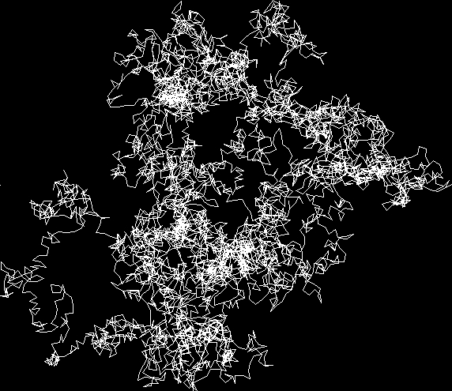
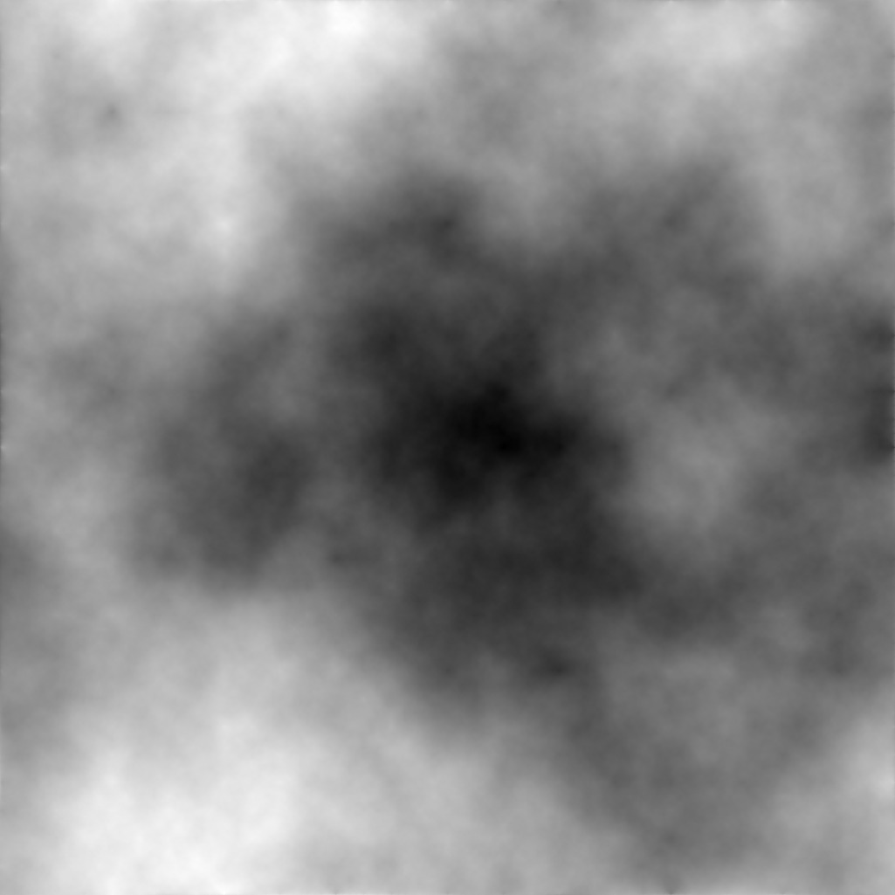
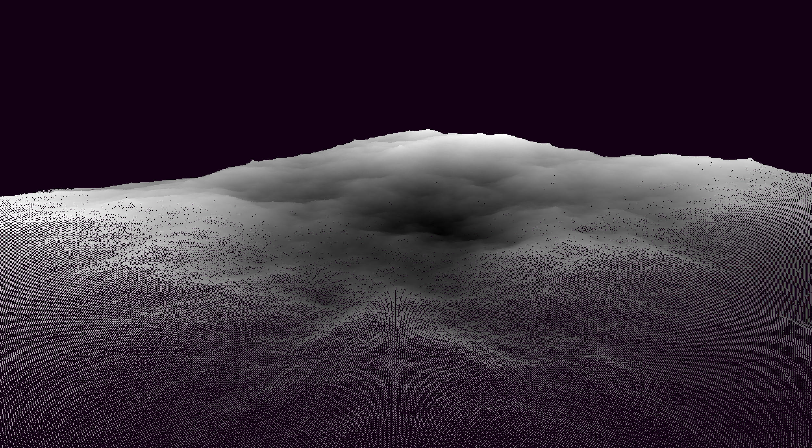
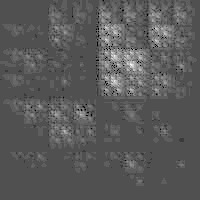
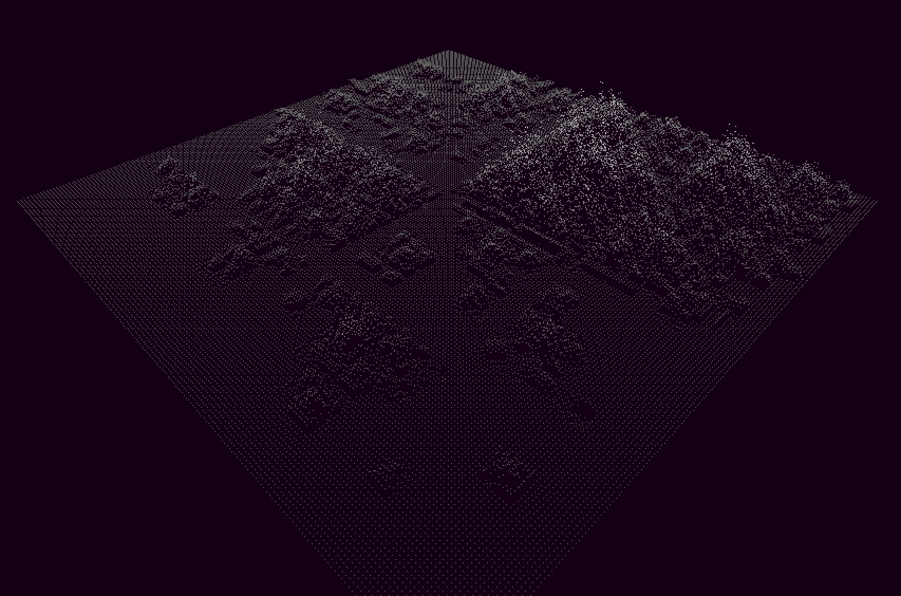
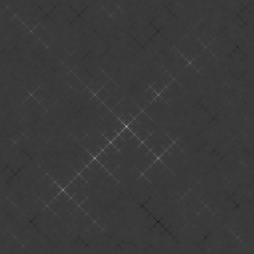
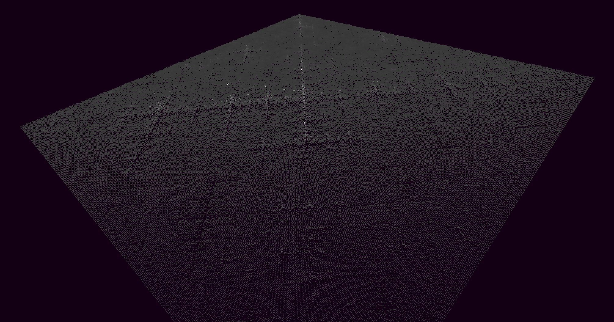

Generating heightmaps progamatically.

Heightfield generated       |  OpenGL rendering
:--------------------------:|:--------------------------:
 | 
:--------------------------:|:--------------------------:
 | 
:--------------------------:|:--------------------------:
 | 
:--------------------------:|:--------------------------:
 | 
